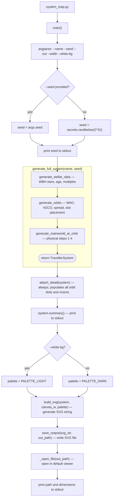

# system_map.py — CLI execution flowchart

Traces every function called when running `python system_map.py`.

This is the only CLI script that always calls `attach_detail` unconditionally —
the SVG map needs secondary world data for every orbit slot to populate the
orbit table.

