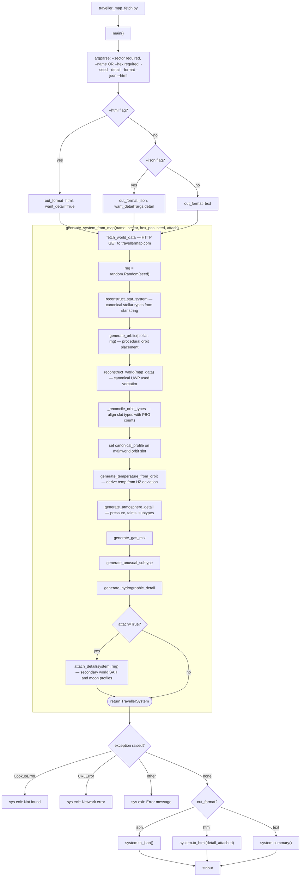

# traveller_map_fetch.py — CLI execution flowchart

Traces every function called when running `python traveller_map_fetch.py`.

Unlike the other CLI scripts, this one populates `atmosphere_detail` on the
mainworld inside `generate_system_from_map`, because the canonical UWP is used
verbatim rather than rolled, so those sub-procedures must be called explicitly.

