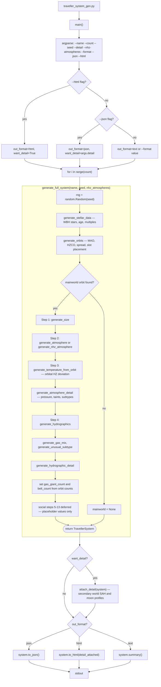

# traveller_system_gen.py — CLI execution flowchart

Traces every function called when running `python traveller_system_gen.py`.

Note: `generate_mainworld_at_orbit` generates physical characteristics only
(steps 1–4, atmosphere detail, hydrographic detail).  Social steps 5–13
(population, government, TL, etc.) are deferred and `apply_mainworld_social`
is **not** called by the CLI, so the mainworld UWP carries placeholder values
for the social characteristics.

