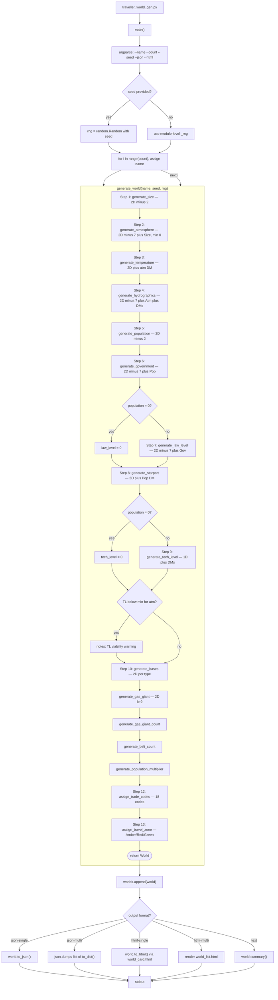

# traveller_world_gen.py — CLI execution flowchart

Traces every function called when running `python traveller_world_gen.py` from
the command line.  Atmosphere detail (`generate_atmosphere_detail`) is **not**
in this path — it is only populated by the API layer and gen-ui.

